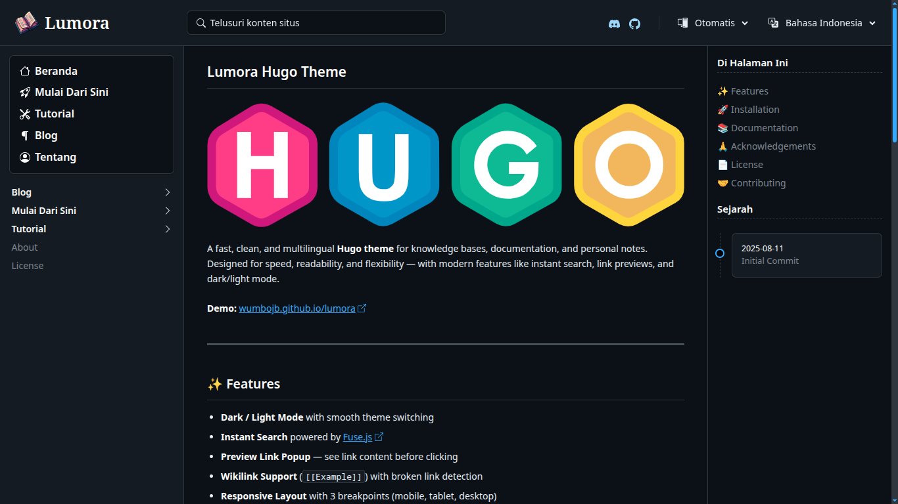
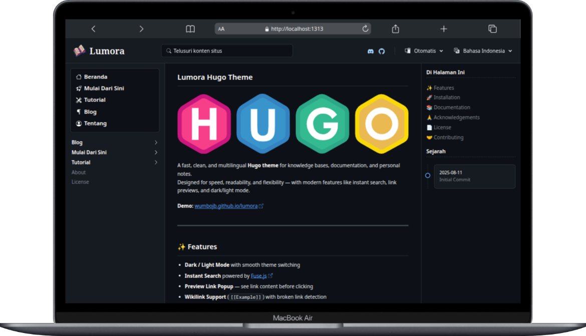
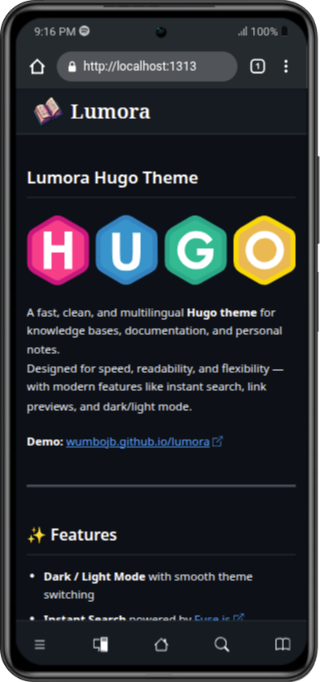
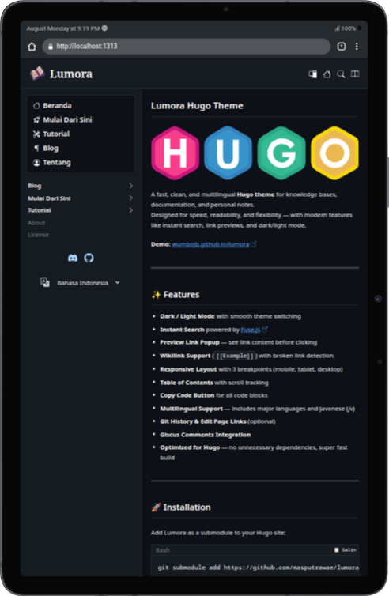

# Lumora — Modern Hugo Theme for Docs & Knowledge Bases

  

Lumora is a **modern, clean, and multilingual** Hugo theme built for **documentation sites, wikis, and personal knowledge bases**.  
It’s **blazing fast**, highly **readable**, and packed with **modern features** like instant search, link previews, and dark/light mode — without sacrificing performance.

💡 **Perfect for:**  
- Developer documentation  
- Product guides & manuals  
- Personal knowledge management  
- Multilingual wikis  

**Demo:** [wumbojb.github.io/lumora](https://wumbojb.github.io/lumora)

---

## ✨ Why Lumora?

- ⚡ **Lightning-Fast Builds** — optimized for Hugo, no bloat
- 🌓 **Dark / Light Mode** — smooth theme switching
- 🔍 **Instant Search** — powered by [Fuse.js](https://fusejs.io)
- 🔗 **Link Previews** — see content before clicking
- 📄 **Table of Contents** — with scroll tracking
- 💬 **Giscus Comments** — built-in community discussions
- 🌐 **Multilingual Ready** — supports major languages + Javanese (*jv*)
- 📦 **Minimal Dependencies** — fast, lightweight, and easy to maintain

---

## 📸 Screenshots

| Full View | Desktop View |
|-----------|--------------|
|  |  |

| Mobile View | Tablet View |
|-------------|-------------|
|  |  |

---

## 🚀 Quick Start

1️⃣ Add Lumora as a Git submodule:

```bash
git submodule add https://github.com/masputrawae/lumora themes/lumora
````

2️⃣ Update your `config.yaml` or `config.toml`:

```yaml
theme: lumora
```

3️⃣ Start your Hugo server:

```bash
hugo server
```

---

## 📚 Documentation

Complete setup & configuration guide:
[https://wumbojb.github.io/lumora](https://wumbojb.github.io/lumora)

---

## 🙏 Acknowledgements

Built with love, inspired by:

* [Hugo](https://gohugo.io/)
* [Fuse.js](https://fusejs.io/)
* [Floating UI](https://floating-ui.com/)
* [Giscus](https://giscus.app/)
* [Bootstrap Icons](https://icons.getbootstrap.com/)
* [Starlight Astro Theme](https://starlight.astro.build/)
* And God, for everything 🙌

---

## 📄 License

Licensed under the [MIT License](LICENSE).

---

## 🤝 Contributing

Got ideas to make Lumora even better?
Contributions are welcome — just open an issue or pull request.
Even small fixes matter!
